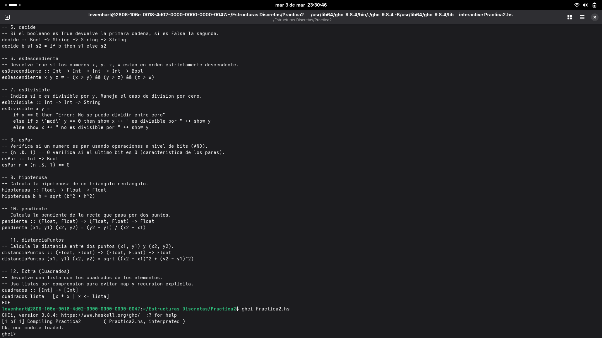

# Práctica 02: Introducción a Haskell

## Información del Estudiante
* **Nombre:** Oscar Leonardo Olvera Ruiz
* **Asignatura:** Estructuras Discretas
* **Semestre:** 2026-2
* **Profesor:** Rafael Reyes Sánchez
* **Ayudante:** Daniel Rojo Mata
* **Ayudante de Laboratorio:** Irvin Javier Cruz Gonzalez

## Descripción y Objetivo
El objetivo de esta práctica es familiarizarse con el entorno interactivo GHCi y la sintaxis fundamental de Haskell, implementando funciones básicas, manejo de tipos de datos, tuplas y listas por comprensión, así como operaciones a nivel de bits.

**Tiempo requerido:** 4 horas.

## Notas de Implementación
* **Suposición en Ejercicio 3 (calcularPropina):** El enunciado sugiere la posibilidad de aplicar un 10% o 15%. Sin embargo, dado que la firma de la función no solicita un segundo argumento para el porcentaje y el ejemplo de ejecución muestra un cálculo del 10% (entrada 1000 $\to$ salida 100), se ha implementado el 10% como valor por defecto para cumplir estrictamente con el caso de prueba proporcionado.

## Evidencia de Ejecución
A continuación se muestra la captura de pantalla de la terminal ejecutando GHCi y cargando el módulo correctamente:

## Análisis del Ejercicio 8: Función esPar

### Lógica de la Implementación
Para determinar si un número $ es par sin utilizar la operación módulo (`mod`) ni recursión, se recurrió a la manipulación de bits (Bitwise operations).

La lógica se basa en la representación binaria de los enteros. En sistema binario, el bit menos significativo (LSB) determina la paridad:
* Si el LSB es **0**, el número es **par**.
* Si el LSB es **1**, el número es **impar**.

La función implementada utiliza el operador *bitwise AND* (`.&.`) de la librería `Data.Bits`. La operación `n .&. 1` compara bit a bit el número $ con el 1 (binario ...0001). Si el resultado es 0, el número es par.

### Justificación Académica: ¿Por qué no se puede utilizar el operador lógico &&?
El sistema de tipos de Haskell es estricto (*Strongly Typed*).
1.  **Tipos incompatibles:** El operador `&&` (AND lógico) tiene la firma `Bool -> Bool -> Bool`. Espera dos valores de verdad.
2.  **Contexto aritmético:** Nuestro problema trata con enteros (`Int`). Intentar evaluar `n && 1` generaría un error de tipos (*Type Mismatch*), ya que el compilador no puede interpretar un número como un booleano implícitamente.
3.  **Solución:** Se debe usar el operador `.&.` de la clase `Bits`, diseñado específicamente para operar sobre la estructura binaria de los enteros.

---
© 2026 Oscar Leonardo Olvera Ruiz.
