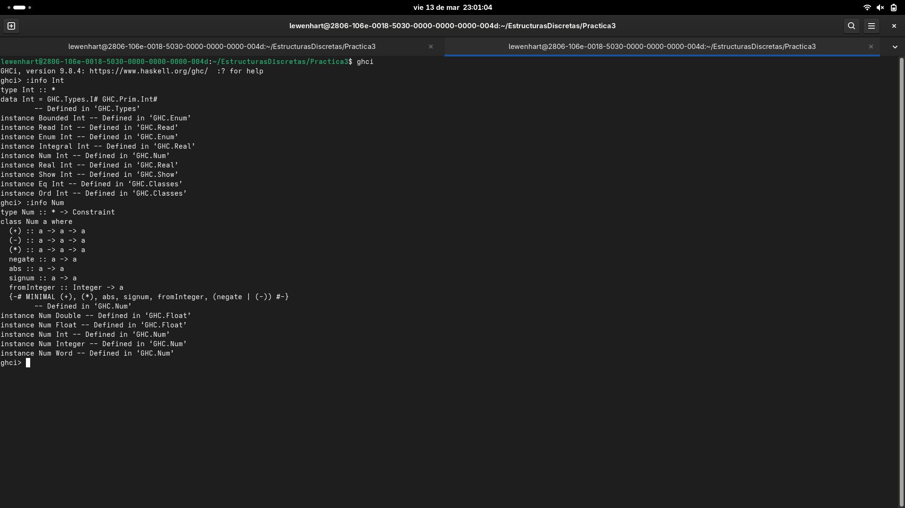

# Práctica 03: Tipos de datos y listas por comprensión

## Información del Estudiante

* **Nombre:** Oscar Leonardo Olvera Ruiz
* **Asignatura:** Estructuras Discretas
* **Información de la versión:** 1.0
* **Profesor:** Rafael Reyes Sánchez
* **Ayudante:** Daniel Rojo Mata
* **Ayudante de Laboratorio:** Irvin Javier Cruz Gónzalez
* **Fecha:** 13 de marzo de 2026
* **Copyright:** © 2026

---

**Tiempo requerido:** ~3 horas

## Objetivo
Comprender la sintaxis y creación de tipos de datos en Haskell, así como el uso de las clases de tipos. Dominar la construcción de listas por comprensión aplicando restricciones de funciones básicas y desarrollando una lógica de programación funcional pura.

## Actividades Teóricas

### 1. ¿Cuál es la diferencia entre Num e Int?
`Int` es un **tipo de dato** específico que representa números enteros con una precisión limitada (usualmente de 64 bits). Por otro lado, `Num` es una **clase de tipos** (typeclass) que agrupa a todos los tipos de datos que se comportan como números y soportan operaciones matemáticas (como `Int`, `Integer`, `Float`, `Double`). En resumen, `Int` es una instancia específica que pertenece a la familia general `Num`.

### 3. Lista infinita de pares naturales
La definición `allPairs = [(x,y) | x <- [0..], y <- [0..]]` **no funciona** correctamente para listar todos los pares distintos de números naturales.
**Justificación:** Por el orden en que Haskell evalúa las listas por comprensión, primero fijará `x = 0` y luego intentará recorrer toda la lista infinita de `y` (0, 1, 2, 3...). Esto generará la secuencia `(0,0), (0,1), (0,2)...` de manera infinita. Como la evaluación de `y` nunca termina, la variable `x` nunca logrará avanzar al valor `1`, dejando fuera a todos los demás pares (como `(1,0)` o `(2,2)`).
**Versión corregida y justificada:**
Para que funcione, debemos generar los pares iterando sobre la suma de sus componentes (técnica de diagonalización).
`allPairs = [(x, d - x) | d <- [0..], x <- [0..d]]`
*Explicación:* Aquí `d` representa la suma de `x + y`. Primero generamos los pares que suman 0 `(0,0)`, luego los que suman 1 `(0,1), (1,0)`, luego los que suman 2 `(0,2), (1,1), (2,0)`, y así sucesivamente. Esto garantiza que recorreremos todos los pares de forma ordenada sin atraparnos en el infinito de una sola variable.

## Comentario Extra
Resulta fascinante observar cómo la evaluación perezosa (lazy evaluation) de Haskell nos permite modelar conceptos matemáticos abstractos, como el infinito, sin desbordar la memoria de la computadora, siempre y cuando estructuremos correctamente nuestras listas por comprensión.
